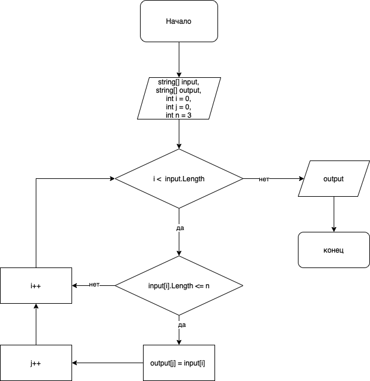

# Задача:

Написать программу, которая из имеющегося массива строк формирует массив из строк, длина которых меньше либо равна 3 символа. Первоначальный массив можно ввести с клавиатуры, либо задать на старте выполнения алгоритма. При решении не рекомендуется пользоваться коллекциями, лучше обойтись исключительно массивами.

## Задание 2. Создание алгоритма решения задачи

## Задание 3. Описание алгоритма решения задачи

* Пользователь указывает сколько элементов (N) он хочет задать и заполняет стартовый массив элементами в цикле N-раз.
* Далее проходим по стартовому массиву в цикле и проверяем, подходит ли элемент условию "длина символов <= 3". 
* Если элемент подходит под данное условие, то мы добавляем его в новый массив, используя при этом дополнительный счетчик, чтобы элементы в новом массиве заполнялись последовательно (без пропусков).

## Задание 4. Решение задачи на C#

В папке Task решение задачи на C#. 
В файле есть два решения данной задачи: 1) решение с помощью двух массивов, 2) решение с одним массивом (элементы для массива вводит пользователь и на этапе ввода сразу идет проверка по условию "длина символов <= 3" и в случае соответствия, данный элемент добавляется в массив).

